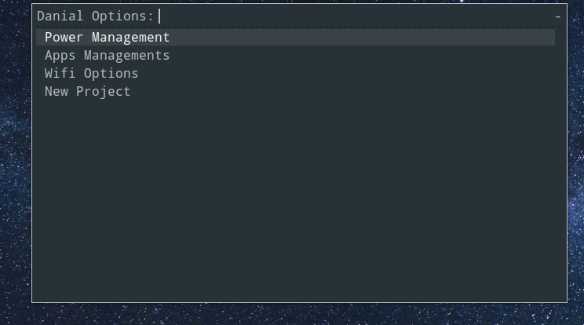

# Rofi-theme:

## Example
Top version

Center version

## Installation :

```sh
cd .config/rofi
git clone https://github.com/Danialdev01/Rofi-top-Menu themes
rofi-theme-selector
```
find danial theme and press alt + a
